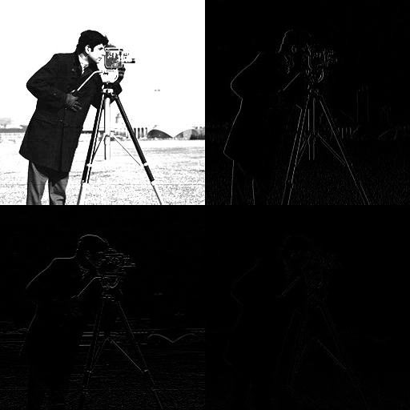

# Orthogonal expansions in image procesing and compression
## Table of contents
- [DCT](#dct)
    - [About](#about)
    - [Programs](#programs)
- [Wavelet transform](#wavelet-transform)    
    - [About](#about-1)
    - [Programs](#programs-1)

## DCT
### About
DCT, or Discrete Cosine Transform, is a widely used technique in image compression. It's a mathematical process that transforms spatial data (pixels in an image) into frequency components. The idea behind DCT-based compression is that images often have a lot of redundant information and correlation between neighboring pixels. DCT helps to represent the image in a more compact form by concentrating most of the image's energy into a few low-frequency coefficients, which can then be stored or transmitted more efficiently.

    

### Program
- [2D-DCT](https://github.com/datapaw/orthogonal_expansion_in_image_processing_and_compression/blob/main/src/main.m#L403)

## Wavelet transform
### About
Wavelet-based compression has emerged as a prominent technique in image compression, boasting distinct advantages over conventional methods such as Discrete Cosine Transform (DCT). Operating on the principle of wavelet transforms, this approach breaks down an image into various frequency components across different scales, facilitating a highly adaptable representation of spatial information within the image. By harnessing the power of wavelet analysis, this method enables a more nuanced understanding of image characteristics, allowing for efficient compression while preserving essential details. This flexibility in representing image data grants wavelet-based compression a competitive edge in achieving higher compression ratios without compromising image quality, making it a favored choice in various applications ranging from medical imaging to multimedia communication.

    

### Programs
- [Haar wavelet](https://github.com/datapaw/orthogonal_expansion_in_image_processing_and_compression/blob/main/src/main.m#L203)
- [Coiflet wavelet](https://github.com/datapaw/orthogonal_expansion_in_image_processing_and_compression/blob/main/src/main.m#L236)
- [Daubeches wavelet](https://github.com/datapaw/orthogonal_expansion_in_image_processing_and_compression/blob/main/src/main.m#L224)
- [Symlet wavelet](https://github.com/datapaw/orthogonal_expansion_in_image_processing_and_compression/blob/main/src/main.m#L248)

## License
Distributed under the MIT License. See [`LICENSE`](/LICENSE) for more information.